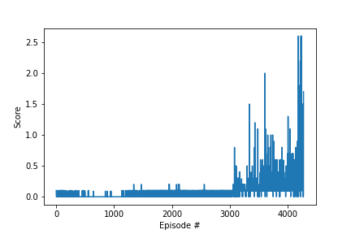

# Project 3: Report

### Implementation

The solution is implemented as a Multi-Agent Deep Deterministic Policy Gradient (MADDPG) model with experience replay. The `Agent` class defines an agent that uses data about the environment's state to choose an action and learn from its experience. The `Actor` class defines the deep neural network for the policy, mapping environment states to continuous agent actions. The `Critic` class defines the deep neural network for the Deep Q-Learning Critic, mapping environment states and actions to action-values. The `ActionNoise` class defines the process used to randomize actions at each step. The `ReplayBuffer` class stores past experiences that the agent samples from to update the model parameters. The `play_tennis()` function trains the agents and outputs scores for each episode.

### Learning Algorithm

The purpose of the learning algorithm is to parameterize a series of Actor and Critic models in the Tennis environment. Since there are two agents in the environment, each with local observations, I train two networks for each. The Actor models estimate the policy function for each agent using only local observations as inputs. The Critic models estimate the action-value (Q-value) function for each agent using the joint observation and joint action space as inputs. After initializing these four networks the agent interacts with the environment over a series of episodes. In each episode the agent considers its observation of the environment, takes actions and receives rewards. Using this data over many episodes the agent updates its estimate of the action-value for each possible action given data about the state of the environment.

The agent interacts with the environment by taking epsilon-greedy actions. Initially the agents act randomly selecting four random actions in the range [-1,1]. The `epsilon` value decays geometrically at a rate of 0.15% per episode until reaching a floor of 5%. Each action updates the state of the environment and returns some reward. Then each experience for both agents is stored in the replay buffer. Every 2 steps through the environment the agent samples 64 experiences from the replay buffer. In total the replay buffer stores the most recent million experiences. I experimented with a number of different epsilon decay rates, floors, buffer sizes, batch sizes, and update frequencies. Higher epsilon decay rates resulted in agents that weren't able to learn from the environment. Since the episodes contain relatively few experiences, the agents need to experiment over many episodes in order to learn actions. Lower floors on epsilon resulted in agents that stopped learning before solving the environment. Each of these hyper-parameters is closely related to the others, studying the relationships among them is an interesting topic for research.

Using these experiences the algorithm trains the four deep neural networks. The Critic models train the model parameters using the Adam optimizer with a learning rate equal to `0.0005`. The Critic's object is to minimize the mean-squared error between the action values predicted by the network (Q_expected) and an estimate of the true action values (Q_targets). The true action values (Q_targets) are estimated as the current reward plus the value of future expected rewards, discounted by `gamma = 0.99`. The Actor models train the model parameters using the Adam optimizer with a learning rate equal to `0.0003`. The Actors' objective is to maximize the mean action-values predicted by the Critic. Both the Actors and Critics use local and target networks to reduce the impact of correlation among sequential experiences. During each update step the agent updates the parameters of both target networks using the local networks with `tau = 0.001`. I experimented with a number of alternative learning rates and found that higher values for the learning rates destabilized the training.

The Critic models each take a state of size 48 and action of size 4 as inputs. The first layer contains 128 nodes with ReLU activation and the second layer contains 64 nodes with ReLU activation. Finally each Critic network outputs two action values using ReLU activation. The Actor models each take an observation of size 24 as input. The first layer contains 128 nodes with ReLU activation and the second layer contains 64 nodes with ReLU activation. Finally each Actor network outputs two action values using tanh activation. I experimented with adding more nodes or fewer notes, but this architecture provide large enough to learn the behavior while being small enough to train in a reasonable period of time.

### Plot of Rewards

After 4175 episodes, the successful agent was able to achieve an average score of +0.5 over its last 100 episodes.

### Ideas for Future Work

This project presents a number of potential avenues for future work. During model development I found that model convergence was particularly sensitive to the choice of exploration method, the epsilon decay and the epsilon floor values. I used epsilon-greedy random continuous actions to explore, however alternative methods may be more efficient in training the agent. Additionally I found that model performance improved by using larger replay buffers and less frequent updates. At a higher level there is an interesting relationship between the exploration structure, the size of the replay buffer, the batch size and the update frequency. All of these features relate to how the agent generates, stores and uses data for model training. 

Another promising avenue for future work is to try using multiple agents with shared experience or adapting the replay buffer to use prioritized experience replay. Both could improve model performance by more efficiently using data received from the environment. Finally I would be interested in trying alternative network architectures and learning rates. In the DDPG algorithm the Critic first needs to learn which states and actions have high Q-values so that the Actor can learn to choose those actions. As a result the structures of the two networks depend on each other in dynamic ways. It would be interesting to know how alternative architectures impact this inter-dependence.
